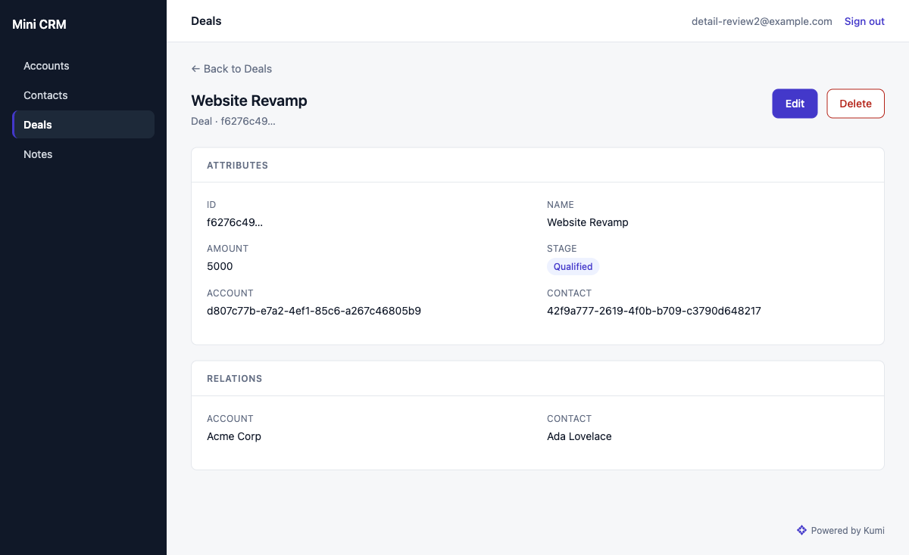

<p align="center">
  
</p>

<h1 align="center">Kumi</h1>

<p align="center">
  <strong>Ash helps you model your application. Kumi helps you ship it as a product.</strong>
</p>

<p align="center">
  <a href="https://github.com/meikocho1/kumi/actions/workflows/ci.yml"></a>
  <a href="LICENSE"></a>
  
</p>

<p align="center">
  English · <a href="README.ja.md">日本語</a>
</p>

Kumi is an application platform for [Ash](https://ash-hq.org) and Phoenix.
You declare your resources; Kumi gives you database plans that say which
changes destroy data, an admin derived from those resources, and a
generator to start from. It never hides Ash at any point, which is the
constraint the rest of the design bends around.

## What it does

`mix ash.codegen` compares your resources against snapshots it generated
itself. That answers "what did my code change?", which is the right
question nearly all of the time.

Nothing in that path opens a connection and looks at the database. So the
moment somebody changes the schema outside a migration, the snapshot
history stops describing reality, and nothing tells you.

Kumi reads `pg_catalog` and diffs it against your resources:

```text
crm_accounts:
  + column notes text  [SAFE: adds nullable column notes]
  ~ column industry (nullable: true -> false)  [REVIEW: tightens industry to NOT NULL — existing NULLs would fail]
  - column legacy_notes text  (in DB, not in code — drift)  [DANGEROUS: drops column legacy_notes — data loss]

1 safe / 1 review / 1 dangerous
```

### The classification is the point

The diff itself is not interesting. Anyone can read `pg_catalog`.

What matters is that every difference is judged on whether resolving it
can destroy data. SAFE is pure additions. REVIEW is constraint tightening
and anything Kumi is guessing at, like a rename. DANGEROUS is everything
that deletes, and type changes fail closed: if Kumi cannot prove a change
is widening, it calls it dangerous.

That last rule will annoy you at some point. It is meant to. A false
DANGEROUS costs you a second look; a missed one costs you a column.

The judgment also never depends on your data. `--probe` is opt-in, runs
read-only counts, and will tell you that the column you are about to make
NOT NULL has 4,102 NULLs in it. What it will not do is change a
classification. `mix kumi.plan --check` has to mean the same thing in CI
no matter which database it is pointed at.

```bash
mix kumi.plan            # the diff
mix kumi.plan --check    # exit 1 if anything is REVIEW or DANGEROUS
mix kumi.apply           # dev only, and only the SAFE subset
```

This does not replace `ash.codegen`. Different question. Run both.

### And then the rest of it

Because your resources are already declared, an admin can be derived from
them:

<p align="center">
  
</p>

Tables, forms, search, `belongs_to` selects, child tables, dashboard
metrics, workflow stages. No per-resource admin code. The admin brings
no authentication of its own and mounts behind whatever you already use.
For sign-in itself, `mix kumi.gen.auth google` writes the OAuth2 wiring
that `ash_authentication` has no installer for.

That part is younger than the plan engine and it shows. Look at the plan
engine first.

## How is this different from `ash_admin`?

They are not really competing. `ash_admin` is a developer's inspector for
your data, generic on purpose, and it is the right tool for poking at
resources in dev.

`kumi_admin` is aimed at the screen you hand to someone who is not a
developer: you declare navigation, dashboard metrics and workflow stages
at the app level. If what you want is to look at your data, use
`ash_admin`.

## What's in here

Four independent Mix packages, released together:

| Package | What it gives you |
|---|---|
| **[`kumi/`](kumi/)** | `mix kumi.plan` — a diff between your Ash resources and your **live** Postgres database, with every change classified `SAFE` / `REVIEW` / `DANGEROUS`. Plus `mix kumi.apply` for safe drift repair, the app-level DSL, and a resource shorthand that prints exactly what it compiles to. |
| **[`kumi_admin/`](kumi_admin/)** | A LiveView admin derived from your resources — tables, forms, search, `belongs_to` selects, child tables, dashboard metrics, workflow stages. No per-resource code, and no authentication of its own: it sits behind whatever your app already uses. |
| **[`kumi_storage/`](kumi_storage/)** | Uploads, as an installable module. Generates a plain Ash resource with an `:upload` action; the admin picks it up automatically. |
| **[`kumi_new/`](kumi_new/)** | `mix kumi.new my_app` — from nothing to a running application with an admin and a login screen, in one command. |

## Where this actually stands

A side project. I use it on my own Ash app. It has never run against
anything I would call production traffic, and you should weigh that
before pointing it at yours.

MIT, 430 tests, nothing published to Hex yet. Not being on Hex is
deliberate: I would rather be told the classification rules are wrong
now than once somebody is depending on them. If you disagree with a
call it makes, that is the most useful issue you could open.

## Three things it won't do

Not gaps. Decisions, and they aren't up for relitigation in the code.

**It won't hide Ash.** Every Kumi DSL compiles to an ordinary Ash resource,
and `mix kumi.expand` prints exactly what you get. There's a test
asserting the printed source matches the compiled definition, so that
claim can't quietly rot. Dropping to plain Ash is the supported path, not
the failure path. If a feature can't round-trip through `kumi.expand`, it
stays out of the shorthand.

**It won't abstract over the data layer.** AshPostgres only. No Ecto
adapter. I don't want to write that and you probably don't want to depend
on it.

**It won't replace `ash.codegen`.** Codegen compares your code to its own
history. Kumi compares your code to the database. Both are worth running,
and I run both.

## Quick look

Kumi is not on Hex yet, so `mix kumi.new` comes from a locally built
archive and needs `--kumi-path` pointing at this checkout. Run this from
the directory *above* your Kumi clone:

```bash
mix archive.install hex igniter_new
mix archive.install hex phx_new
(cd Kumi/kumi_new && mix archive.build && mix archive.install)  # confirm the [Yn] prompt

# From nothing to a running app: Ash, Phoenix, auth, admin, database.
mix kumi.new my_crm --kumi-path Kumi --db-port 5434
```

(Once Kumi ships to Hex, `--kumi-path` and the archive build both go away.)

`--kumi-path` has to be the checkout's *real* path. Pass a symlink and Mix
rejects the generated project with "the dependency kumi in mix.exs is
overriding a child dependency", because the absolute path written into
your `mix.exs` stops matching the `../kumi` that `kumi_admin` declares.
The quick start above walks straight into this if the path you pass is a
symlink, which is why it's written down here rather than left for you to
rediscover.

Then, from inside `my_crm/`:

```bash
# What does my database actually look like, compared with my code?
mix kumi.plan
#   SAFE       add_column accounts.industry (text, nullable)
#   REVIEW     possible_rename accounts.title -> accounts.name
#   DANGEROUS  remove_column accounts.legacy_code  (deletes data)

# Repair only the safe drift, in dev, in one transaction.
mix kumi.apply

# What does this shorthand resource really compile to?
mix kumi.expand MyCrm.Core.Account
```

Adding Kumi to an **existing** app instead? See
[`kumi/README.md`](kumi/README.md#existing-app).

## Documentation

- **[`kumi/README.md`](kumi/README.md)** — install, the plan engine, the
  DSLs, every mix task.
- **[`kumi_admin/README.md`](kumi_admin/README.md)** — mounting the admin,
  every router option, and the two things that bite newcomers (no auth of
  its own; every managed resource needs an `:id` primary key).
- **[`kumi_storage/README.md`](kumi_storage/README.md)** — uploads: install,
  the `:image` field, validation defaults, the backend contract.
- **[`kumi/guides/mini-crm.md`](kumi/guides/mini-crm.md)** — build a
  small CRM end to end. Every snippet in it was executed.
- **[`kumi/guides/api.md`](kumi/guides/api.md)** — adding a JSON:API when
  you need one, and how relationship depth works.
- **[`kumi/guides/auth.md`](kumi/guides/auth.md)** — sign-in strategies,
  `mix kumi.gen.auth google` for the OAuth2 providers that have no
  upstream installer, and where two-factor auth actually has to come from.
- **[`kumi/guides/frontend.md`](kumi/guides/frontend.md)** — putting your
  public-facing frontend on the same Phoenix app as the admin, including
  the security headers that silently break embedding when they are wrong.
- **[`kumi/guides/ash-gotchas.md`](kumi/guides/ash-gotchas.md)** — the
  non-obvious Ash / Spark / AshPostgres / Igniter behaviours that cost real
  debugging time to track down while this was being built.

## Requirements

Elixir and OTP as pinned in [`.tool-versions`](.tool-versions), and
PostgreSQL 17.

## Contributing

Bug reports, features and PRs are welcome. See
**[`CONTRIBUTING.md`](CONTRIBUTING.md)** for setup, the checks CI runs,
and what a reviewer looks for. Security issues go through private
reporting instead: **[`SECURITY.md`](SECURITY.md)**.

## License

MIT — see [`LICENSE`](LICENSE).
